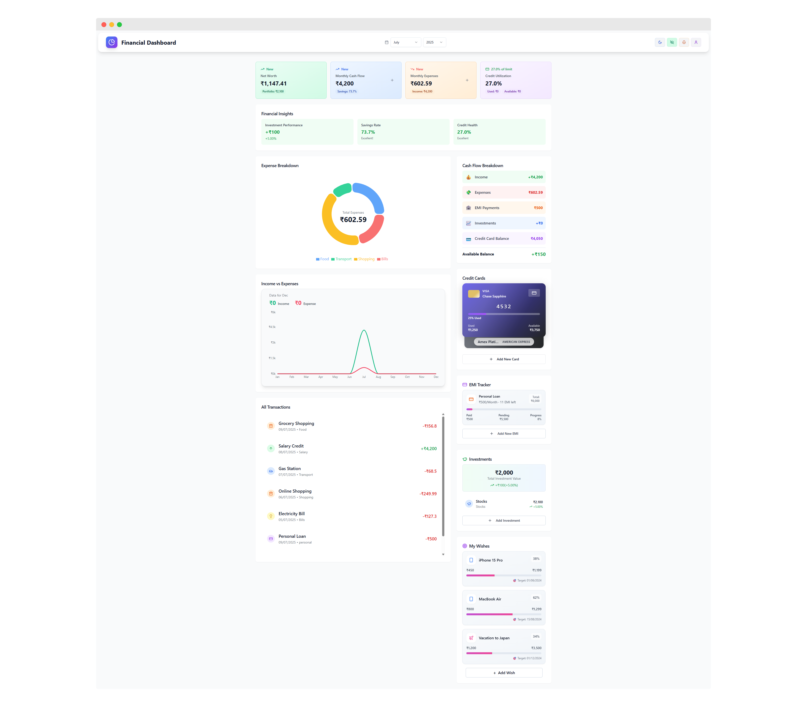

# 💸 Financial Dashboard

A modern, robust, and user-friendly personal finance dashboard to track your income, expenses, investments, EMIs, credit cards, and wishes—all in one place.

---

<p align="center">
  
</p>

---

## 🚀 Features

- 📊 Dashboard overview with charts and analytics
- 💰 Track income, expenses, investments, and EMIs
- 💳 Credit card management (Visa, Mastercard, Amex, Discover, Rupay)
- 📝 Add, edit, and delete transactions
- 🗂️ Categorize expenses and set payment method (Cash, Credit Card, UPI)
- 🔄 Real-time balance calculation (avoids double counting credit card usage)
- 🎯 Wish list and goal tracking
- 🌗 Responsive, beautiful UI with dark mode

---

## 🛠️ Tech Stack

- [Vite](https://vitejs.dev/) + [React](https://react.dev/) + [TypeScript](https://www.typescriptlang.org/)
- [Tailwind CSS](https://tailwindcss.com/)
- [shadcn/ui](https://ui.shadcn.com/)
- Generic backend/database integration (bring your own backend)

---

## ⚡ Getting Started

1. **Clone the repository:**
   ```sh
   git clone <YOUR_GIT_URL>
   cd financial-dashboard
   ```
2. **Install dependencies:**
   ```sh
   npm install
   ```
3. **Configure your backend/database:**
   - Update the placeholder config files in `database/` and `src/integrations/`.
   - Set up your own environment variables as needed.
4. **Run the development server:**
   ```sh
   npm run dev
   ```
5. **Build for production:**
   ```sh
   npm run build
   ```

---

## 🎨 Customization

- Update your backend/database credentials in the config files.
- Change the favicon and branding in `public/` and `index.html`.
- Extend or replace the backend logic in `src/integrations/`.

---

## 📂 Project Structure

```
financial-dashboard/
├── public/
│   ├── snapshot-dashboard.png
│   └── ...
├── src/
│   ├── components/
│   ├── integrations/
│   ├── pages/
│   └── ...
├── database/ (placeholder for backend config)
├── firebase.json (generic hosting config)
└── ...
```
## 🖼️ Website link to preview

https://my-financial-dash.web.app/

---

## 📝 License

This project is licensed under the MIT License. See the [LICENSE](LICENSE) file for details.

---

© 2025 Shahan Rai. All rights reserved.
